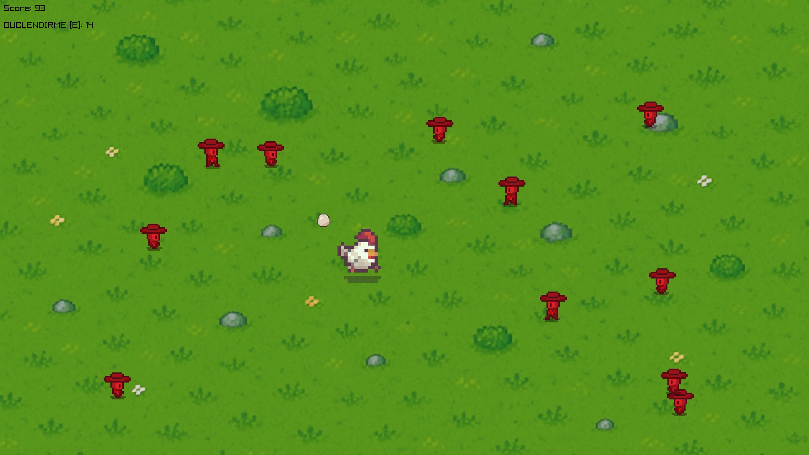
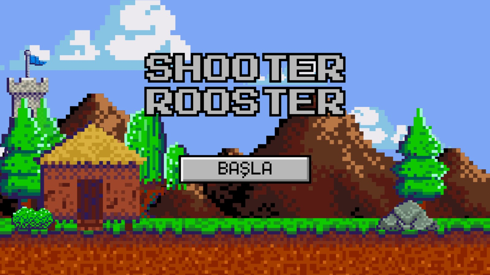
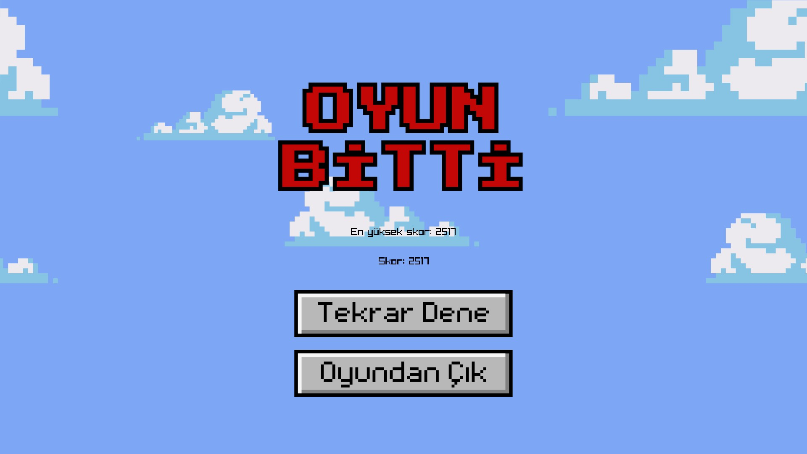

# **🐔 Shooter Rooster**

**Shooter Rooster**, C++ ve Raylib kullanılarak geliştirilmiş, retro grafiklerle bezeli hızlı tempolu bir 2D bullet hell oyunudur. Asuman isimli bir tavuğun kontrolünü ele alarak ekranı yumurta mermileriyle doldurun, düşmanları yok edin ve hayatta kalmaya çalışın!

## __Proje Hakkında__

Shooter Rooster isimli bu oyunu "Programlama Dilleri Laboratuvarı" adlı dersimizin projesi olarak yaptık.

## Hikaye

Oyunun ana karakteri bir tavuktur ismi ise **Asuman**'dır. Asuman'ın kocası olan Horoz Hikmet'i çiftlikteki çalışanlar bilinmeyen bir nedenden dolayı kaçırmıştır ve Asuman da Hikmet'i kurtarmak için elinden geleni yapmaya hazırdır.

## 🎮 Oynanış

Asuman'ı kontrol ederek düşman dalgalarıyla savaşıyorsunuz. Yumurtaları mouse ile hedefleyin, düşmanlara nişan alın ve onları saf dışı bırakın! Sınırlı süreli güçlendirmeleri taktiksel kullanarak daha fazla düşmanı alt edebilirsiniz.

### Oyun Mekanikleri

- 🕹 WASD ile hareket
- 🎯 Mouse konumuna ateş: Sol tık ile Asuman, mouse yönüne yumurta fırlatır
- 💥 Yumurta isabet ederse düşman ölür
- 🧟 Sürekli olarak yeni düşmanlar doğar
- ⚡ *E tuşu ile güçlendirme*:
  - Asuman 5 saniye boyunca mouse yönüne *otomatik olarak yumurta yağdırır*
  - Güçlendirme 15 saniyelik bekleme süresine sahiptir

### Özellikler

- 🎨 Pixel art grafikler
- 🔊 Ses efektleri ve müzik
- 💣 Sonsuz düşman akışı
- 🐔 Efsanevi tavuk savaşçımız Asuman

## 🎮 Kontroller

| Tuş / Eylem         | İşlev                                                     |
|---------------------|-----------------------------------------------------------|
| W / A / S / D       | Tavuk hareketi                                            |
| Mouse Sol Tık       | Mouse yönüne yumurta fırlatma                             |
| E                   | Güçlendirme: Otomatik ateş (5 saniye, 15s bekleme süresi) |
| ESC                 | Oyunu kapatma                                             |

